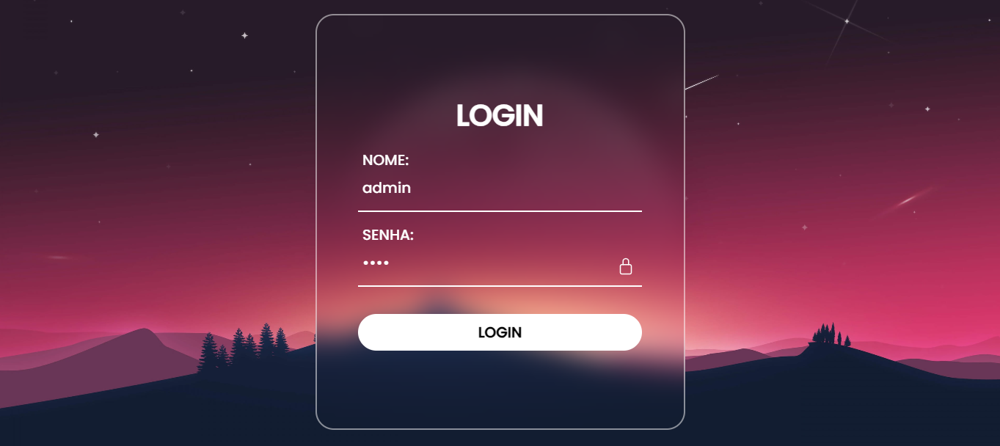
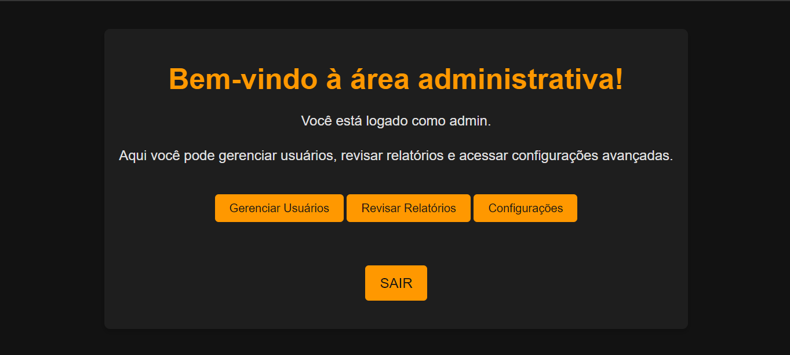
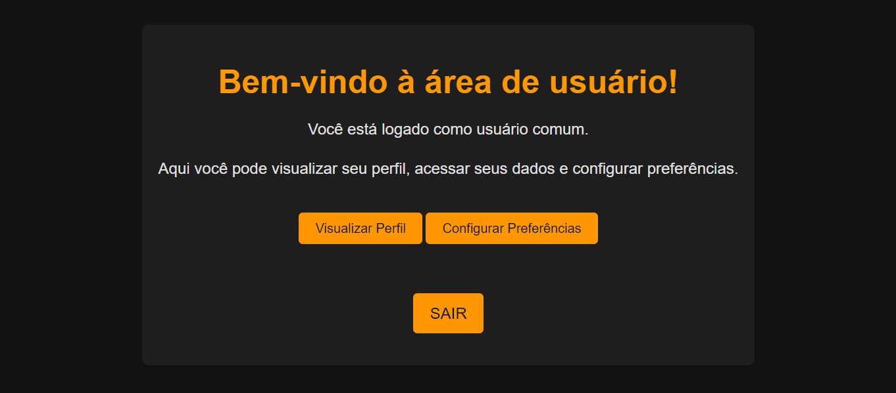

# EXPRESS MIDDLEWARE
👨‍🏫CONTROLHE DE ACESSO A ROTAS COM EXPRESS MIDDLEWARE.

 <br>
 <br>
 <br>

## DESCRIÇÃO:
Este aplicativo é uma aplicação web simples de login e controle de acesso, desenvolvida usando Node.js e o framework Express. Ele permite que usuários façam login utilizando credenciais, e com base nessas credenciais, redireciona-os para uma área específica: a área administrativa ou a área de usuário comum. O aplicativo usa variáveis de ambiente para definir as credenciais de administrador e protege as rotas, garantindo que apenas usuários autorizados possam acessar determinadas páginas.

## FUNCIONALIDADES:
1. **Sistema de Login**: O aplicativo apresenta um formulário de login onde o usuário deve inserir seu nome e senha. Essas credenciais são comparadas com as armazenadas no servidor (via variáveis de ambiente).

2. **Controle de Acesso**:
   - **Admin**: Se o usuário fornecer as credenciais corretas de administrador, ele será redirecionado para a área administrativa.
   - **Usuário Comum**: Se o usuário não for administrador (ou fornecer credenciais incorretas), ele será redirecionado para a área de usuário comum.

3. **Áreas Diferenciadas**:
   - **Área Administrativa**: Um painel onde o administrador pode acessar funcionalidades como gerenciar usuários, revisar relatórios e ajustar configurações.
   - **Área de Usuário**: Uma página para usuários comuns acessarem seu perfil e configurarem suas preferências.

4. **Design Responsivo e Estilizado**: O aplicativo tem um design escuro e moderno, com botões de alto contraste que melhoram a acessibilidade e a experiência do usuário.

## COMO USAR?
1. **Instale as Dependências:**
   - Execute `npm install` no diretório `./CODIGO` para instalar as dependências do projeto:

     ```bash
     npm install
     ```
    
    - Este comando instala todas as dependências listadas no arquivo `package.json` do projeto.

2. **Configuração de Variáveis de Ambiente**: Você pode editar o `./CODIGO/.env` ou fazer o login com as credenciais do administrador:

  ```dotenv
  ADMIN_NAME=admin
  ADMIN_PASSWORD=1234
  ```

3. **Inicie o Servidor:**
   - Ainda no diretório `./CODIGO`, execute o servidor Node.js com o comando:

     ```bash
     npm start
     ```

   - O servidor estará disponível em [http://localhost:2000](http://localhost:2000).

4. **Usando o Aplicativo:**
  - **Login**: Na página inicial, insira o nome e a senha. Se os dados correspondem ao administrador configurado no `.env`, você será redirecionado para a área administrativa. Caso contrário, será redirecionado para a área de usuário comum.

  - **Área Administrativa**: Aqui você pode acessar links para gerenciar usuários, revisar relatórios e acessar configurações (links representativos, pois essas funcionalidades não estão implementadas).

  - **Área de Usuário**: Esta página oferece opções para visualizar o perfil e configurar preferências do usuário.

  - Em ambas as áreas (administrativa e de usuário), há um link "Sair" que redireciona o usuário de volta à página de login.

## POSSÍVEIS EXPANSÕES:
Este aplicativo básico pode ser expandido para incluir funcionalidades como:
- Criação e gerenciamento de perfis de usuário.
- Integração com banco de dados para armazenar informações de usuários.
- Implementação de autenticação e autorização mais robustas.
- Funcionalidades completas para administração, como gerenciamento real de usuários e revisão de dados.

## NÃO SABE?
- Entendemos que para manipular arquivos em `HTML`, `CSS` e outras linguagens relacionadas, é necessário possuir conhecimento nessas áreas. Para auxiliar nesse aprendizado, oferecemos cursos gratuitos disponíveis:
* [CURSO DE HTML E CSS](https://github.com/VILHALVA/CURSO-DE-HTML-E-CSS)
* [CURSO DE JAVASCRIPT](https://github.com/VILHALVA/CURSO-DE-JAVASCRIPT)
* [CURSO DE NODEJS](https://github.com/VILHALVA/CURSO-DE-NODEJS)
* [CURSO DE EXPRESSJS](https://github.com/VILHALVA/CURSO-DE-EXPRESSJS)
* [CONFIRA MAIS CURSOS](https://github.com/VILHALVA?tab=repositories&q=+topic:CURSO)

## SUBSÍDIOS:
- [MINICURSO CRIADO PELO VILHALVA](https://github.com/VILHALVA)
- [TRECHOS DO CSS DE LOGIN FOI COPIADO DE "FORMULARIO ANIMATE"](https://github.com/VILHALVA/FORMULARIO-ANIMATE)
- [CLIQUE AQUI PARA ACESSAR AO MINICURSO](./MINICURSO.md)


